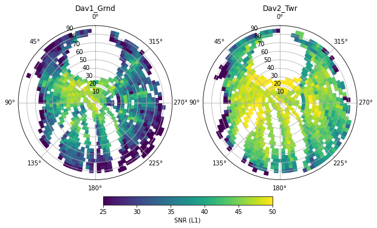

# GNSSVOD
Python Toolkit for deriving Vegetation Optical Depth (VOD) from pairs of GNSS receivers developed by Vincent Humphrey (vincent.humphrey@geo.uzh.ch). Many functions are based on the GNSSpy Toolkit.




### Installation

Directly install package from PyPI via
```
pip install gnssvod
```

### Versions

Refer to the [list of changes](CHANGELOG.md)

### Usage

Refer to the example notebooks:

[Processing raw RINEX data](examples/01_demo_processing.ipynb)

[Merging processed data](examples/02_demo_gathering.ipynb)

[Plotting raw data](examples/03_demo_hemispheric_plotting.ipynb)

[Calculating and plotting GNSS-VOD](examples/04_demo_gnss_vod.ipynb)